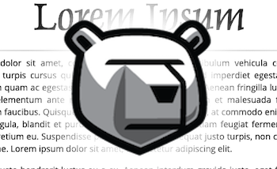
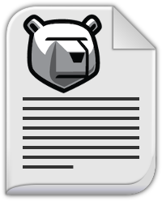

.. Copyright (c) 2018 RackN Inc.
.. Licensed under the Apache License, Version 2.0 (the "License");
.. DigitalRebar Provision documentation under Digital Rebar master license
..

Digital Rebar Provision Content
~~~~~~~~~~~~~~~~~~~~~~~~~~~~~~~

This repository contains the Community Content for used with Digital Rebar
Provision (DRP).  Please see http://rebar.digital for more infomation on DRP.

If you are interested in learning the basics on creating, maintaining, and
using DRP content, you may want to check out the Colordemo repo, which is
available at:

* https://github.com/digitalrebar/colordemo

The colordemo repo has documentation on managing content, along with some
video demonstrations on how to use it.

This repo contains multiple "content packs", and is also an example of how
multiple content packs can be maintained in a single source code repo.  You
may choose to keep your content packs in separate repos, or not...

Examples of different content packs are as follows:

=====================  ============================================================
directory              used for
=====================  ============================================================
content/               main "drp-community-content" pack
krib/                  Kubernetes Rebar Integrated Bootstrap content pack
rose/                  Rebar OpenStack Environment - single node master and cluster
sledgehammer-builder/  contains the Sledgehammer Builder content
=====================  ============================================================
